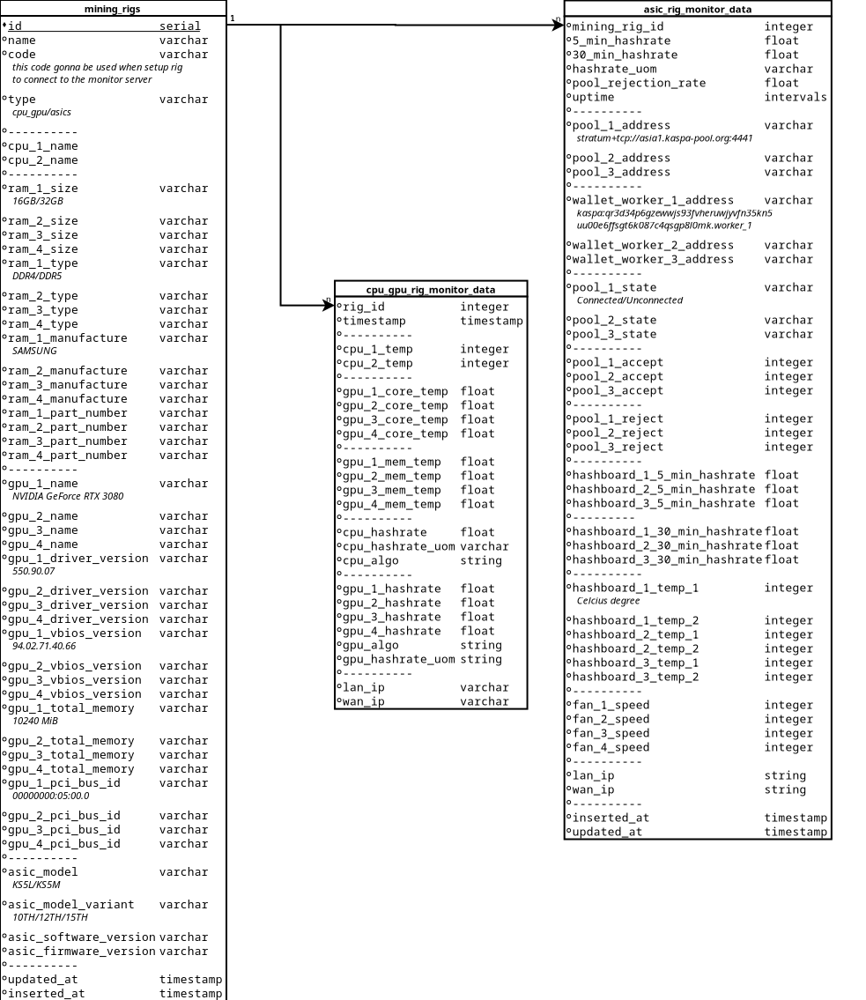

# MiningRigMonitor

To start your Phoenix server:

  * Run `mix setup` to install and setup dependencies
  * Start Phoenix endpoint with `mix phx.server` or inside IEx with `iex -S mix phx.server`

Now you can visit [`localhost:4000`](http://localhost:4000) from your browser.

Ready to run in production? Please [check our deployment guides](https://hexdocs.pm/phoenix/deployment.html).

## Learn more

  * Official website: https://www.phoenixframework.org/
  * Guides: https://hexdocs.pm/phoenix/overview.html
  * Docs: https://hexdocs.pm/phoenix
  * Forum: https://elixirforum.com/c/phoenix-forum
  * Source: https://github.com/phoenixframework/phoenix

# Database Diagram
Please check `/diagrams/db.dia`



# Q&A
1. How to get info from nvidia-smi
```bash
$ nvidia-smi --query-gpu=name,driver_version,vbios_version,pci.bus_id,memory.total --format=csv
name, driver_version, vbios_version, pci.bus_id, memory.total [MiB]
NVIDIA GeForce RTX 3080, 550.90.07, 94.02.71.40.66, 00000000:05:00.0, 10240 MiB
```
2. How to get ram info
```bash
$ dmidecode --type 17
Handle 0x0032, DMI type 17, 40 bytes
Memory Device
	Array Handle: 0x0030
	Error Information Handle: Not Provided
	Total Width: 72 bits
	Data Width: 64 bits
	Size: 32 GB
	Form Factor: DIMM
	Set: None
	Locator: P2-DIMMF1
	Bank Locator: P1_Node1_Channel1_Dimm0
	Type: DDR4
	Type Detail: Synchronous
	Speed: 2400 MT/s
	Manufacturer: Samsung
	Serial Number: 02E20563
	Asset Tag: P2-DIMMF1_AssetTag (date:16/34)
	Part Number: M393A2K40BB1-CRC
	Rank: 2
	Configured Memory Speed: 2400 MT/s
	Minimum Voltage: Unknown
	Maximum Voltage: Unknown
	Configured Voltage: Unknown
```

3. How to get Ice River Operational Data?
Check out this [Kaspa Asic - KS5L - API sample to get operational stage](https://hexalink.xyz/mining-rig/2024/07/15/Kaspa-Asic-KS5L-API-sample-to-get-operational-stage.html)

``` sh
$ curl 'http://192.168.1.XXX/user/userpanel' \
  -H 'Accept: application/json, text/javascript, */*; q=0.01' \
  -H 'Accept-Language: en-US,en;q=0.9,vi-VN;q=0.8,vi;q=0.7' \
  -H 'Connection: keep-alive' \
  -H 'Content-Type: application/x-www-form-urlencoded; charset=UTF-8' \
  -H 'Cookie: language=en; ctime=1' \
  -H 'DNT: 1' \
  -H 'Origin: http://192.168.1.XXX' \
  -H 'Referer: http://192.168.1.XXX/' \
  -H 'User-Agent: Mozilla/5.0 (X11; Linux x86_64) AppleWebKit/537.36 (KHTML, like Gecko) Chrome/126.0.0.0 Safari/537.36' \
  -H 'X-Requested-With: XMLHttpRequest' \
  --data-raw 'post=4' \
  --insecure
```
