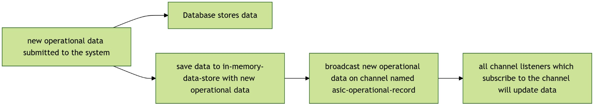

# 001. How to have realtime update operational stats on the mining rig index(ASIC section only) page?

## Abstract
On the mining rig index page, the main purpose of this page is to display all available mining rigs. However, it's more UI friendly if we
can display OPERATIONAL STATS such as hashrate, power consumption, uptime, temperature and mining coin, the latest stats should be displayed, not historical data involved.
and it's operational stats.

The relationship between ASIC miner and operational stats is one-to-many. On the index page, we only display the latest stats. We would like to have the following feature.

- Minimize number of read operation from database.
- Update data realtime.

## Dataflow

